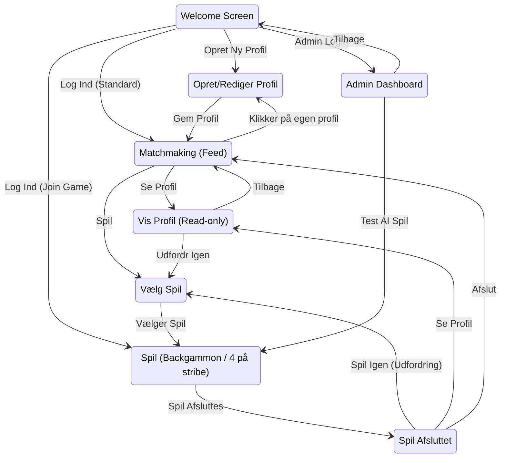

# Single Backgammon - App Flow

> *Dette dokument er autogenereret ud fra `docs/flow.json` via `node scripts/generate_flow_diagram.js`.*

## Visuelt Flow

## Skærme (Screens)

### Welcome Screen (`welcome`)
- **Beskrivelse:** Startskærm hvor brugeren indtaster sit navn for at logge ind.

### Opret/Rediger Profil (`profile_edit`)
- **Beskrivelse:** Skærm hvor brugeren indtaster oplysninger om sig selv (bio, alder, niveau).

### Vis Profil (Read-only) (`profile_view`)
- **Beskrivelse:** Læsetilstand af en modstanders profil.

### Matchmaking (Feed) (`matchmaking`)
- **Beskrivelse:** Oversigt over mulige modstandere baseret på dating- og spilkriterier.

### Vælg Spil (`select_game`)
- **Beskrivelse:** Lader brugeren vælge hvilket spil de vil spille mod modstanderen.

### Spil (Backgammon / 4 på stribe) (`game`)
- **Beskrivelse:** Selve spil-brættet. Systemet indlæser automatisk det valgte spil (Backgammon eller 4 på stribe).

### Spil Afsluttet (`postgame`)
- **Beskrivelse:** Viser resultatet af spillet og giver muligheder for næste skridt.

### Admin Dashboard (`stats`)
- **Beskrivelse:** Viser overordnet platform-statistik, popularitets-sammenligning og fejlrapporter.
- **Adgang:** Tilgås via `/admin` i browserens adresselinje.

## Overgange (Transitions)

| Fra | Til | Handling | Betingelse / Note |
| --- | --- | -------- | ----------------- |
| `welcome` | `profile_edit` | **Opret Ny Profil** | Bruger trykker 'OPRET NY PROFIL' |
| `welcome` | `matchmaking` | **Log Ind (Standard)** | Uden aktivt spil (Game ID) |
| `welcome` | `game` | **Log Ind (Join Game)** | Game ID i URL |
| `welcome` | `stats` | **Admin Login** | Tilgås via `/admin` i browserens adresselinje |
| `profile_edit` | `matchmaking` | **Gem Profil** | Profil gemmes succesfuldt |
| `matchmaking` | `profile_edit` | **Klikker på egen profil** | Trykker på avatar øverst til højre |
| `matchmaking` | `profile_view` | **Se Profil** | Kigger på en mulig modstander |
| `matchmaking` | `select_game` | **Spil** | Bruger trykker '[ SPIL ]' på et match |
| `select_game` | `game` | **Vælger Spil** | Bruger vælger Backgammon eller 4 på stribe |
| `game` | `postgame` | **Spil Afsluttes** | En spiller vinder |
| `postgame` | `select_game` | **Spil Igen (Udfordring)** | Går til spilvalg for samme modstander |
| `postgame` | `profile_view` | **Se Profil** | Kigger på modstanderens profil |
| `postgame` | `matchmaking` | **Afslut** | Afslutter nuværende spil-loop |
| `profile_view` | `matchmaking` | **Tilbage** | Går tilbage til feedet |
| `profile_view` | `select_game` | **Udfordr Igen** | Starter et nyt spil herfra |
| `stats` | `welcome` | **Tilbage** | Går tilbage til startskærm |
| `stats` | `game` | **Test AI Spil** | Trykker på '🤖 TEST SPIL MOD AI' |
